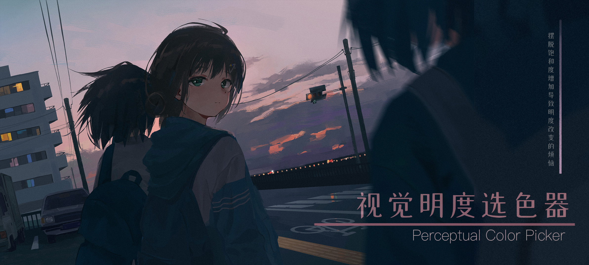
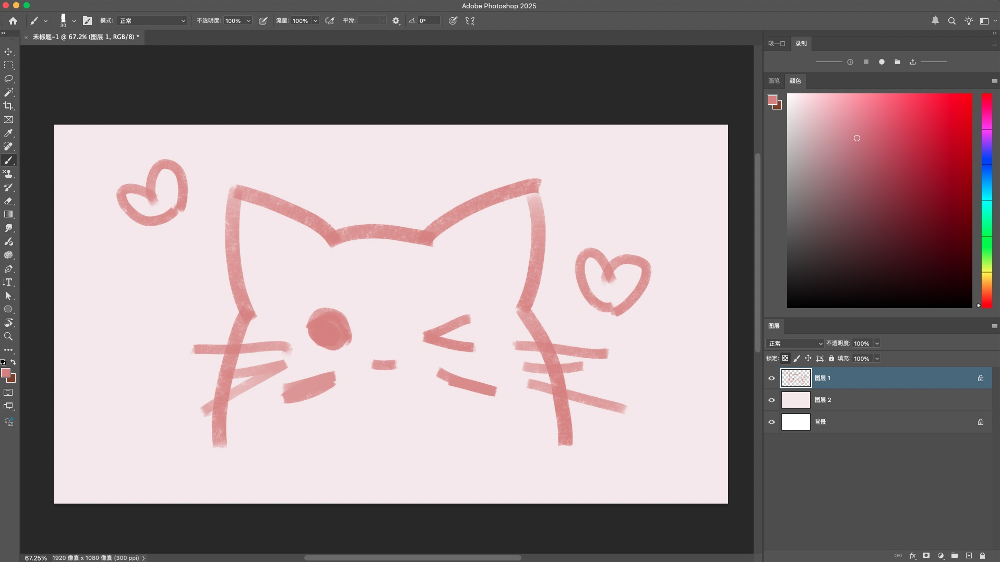
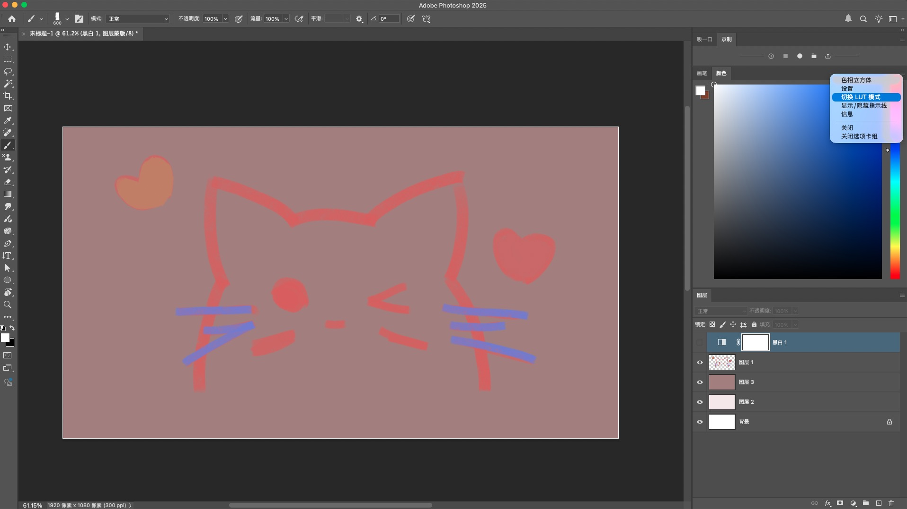
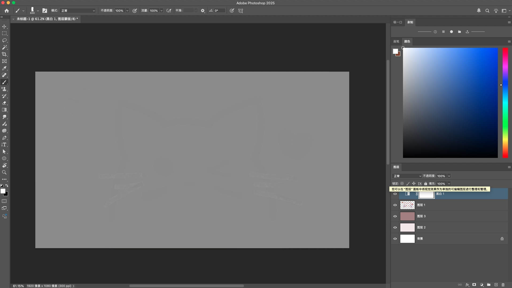
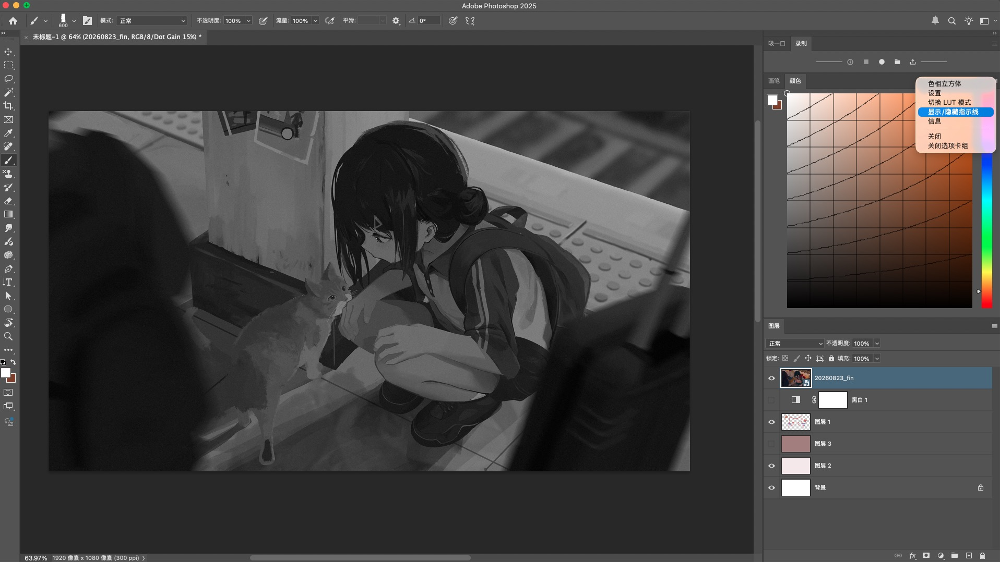

  

  <a href="#快速开始">快速开始</a>
  &nbsp;&nbsp;·&nbsp;&nbsp;
  <a href="docs/USER_GUIDE.md">使用指南</a>
  &nbsp;&nbsp;·&nbsp;&nbsp;
  <a href="docs/INSTALL.md">安装说明</a>

 

> **Perceptual Color Picker** 是一个 Photoshop UXP 选色插件。它可用于解决 HSV 选色时，饱和度改变导致视觉明度改变的问题，帮助绘画时更好的组织明度关系。

 

## 功能概览

### 普通选色

与ps原生色相立方体完全相同的取色方式。

  

### 等明度模式

点击`切换 LUT 模式`，以启用时的视觉明度为目标，调整颜色时保持视觉明度不变。

<table>
  <tr>
    <td align="center" width="50%"></td>
    <td align="center" width="50%"></td>
  </tr>
</table>

### 辅助线

显示水平线、等明度线及色相分隔，调整数量和不透明度。

  

 

详细操作见[使用指南](docs/USER_GUIDE.md)。

## 下载与安装

见[安装说明](docs/INSTALL.md)。
